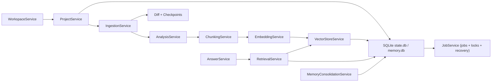
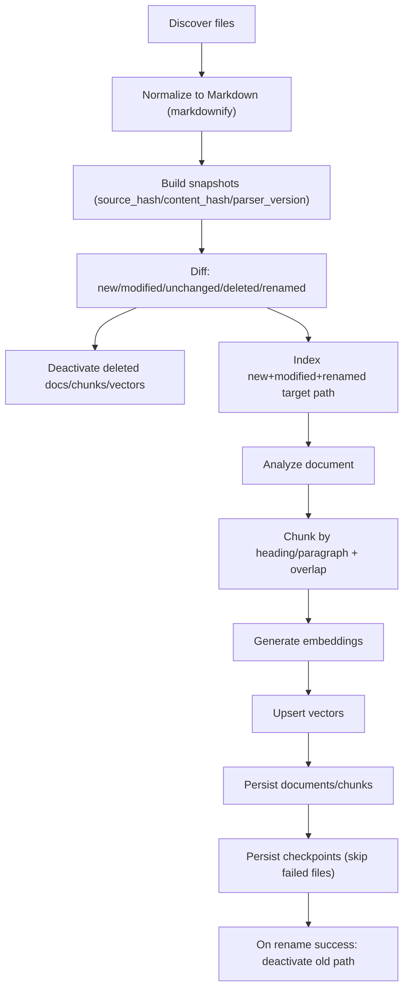
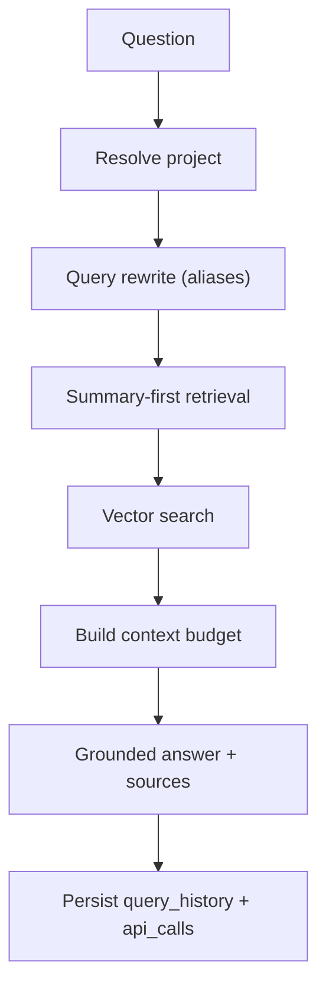

# pigmeu-never-forget

Sistema RAG multiprojeto, local-first, com isolamento por projeto, indexação incremental, memória persistente e integração futura com API/MCP/agents.

## Fonte Canônica

Este projeto agora vive dentro do monorepo:

- `/home/ubuntu/projects-workspace/god-of-skills/projects/pigmeu-never-forget`

Documentação central de skills, MCPs e operação do OpenCode fica em:

- `/home/ubuntu/projects-workspace/god-of-skills/docs/`

## Visão Geral

Cada subdiretório imediato do workspace é tratado como um projeto independente com:

* `.rag/` próprio
* `state.db` (estado operacional)
* `memory.db` (memória consolidada)
* coleção vetorial própria (`kb_<project_slug>`)
* logs e artefatos isolados

O objetivo é permitir consulta RAG confiável com custo de contexto controlado, sem depender do histórico da sessão do agente.

## Arquitetura



## Fluxo de Sincronização (Indexação)



## Fluxo de Consulta (Alvo)



## Diagrama Consolidado (Mermaid + PNG)

* Fonte Mermaid: [docs/diagrams/fluxo-funcionalidades.mmd](docs/diagrams/fluxo-funcionalidades.mmd)
* Export PNG: [docs/diagrams/fluxo-funcionalidades.png](docs/diagrams/fluxo-funcionalidades.png)

## Estrutura do Projeto

```text
pigmeu-never-forget/
  src/pigmeu_never_forget/
    config/        # defaults + loader
    domain/        # enums, errors, dataclasses
    services/      # workspace, project, jobs, ingestion, indexing, etc.
    storage/       # sqlite, migrations, registry
    utils/         # merge, paths
  tests/           # testes de unidade e integração local
  docs/            # arquitetura, contratos, dados, jobs, ADRs
```

## Funcionalidades Implementadas

* Bootstrap de workspace e projeto (`_workspace`, `.rag`, configs padrão)
* Migrations forward-only para `state.db` e `memory.db`
* Jobs, locks exclusivos por projeto e recovery de heartbeat stale
* Ingestão incremental com:
  * formatos suportados: `txt`, `md`, `pdf`, `docx`, `html`, `json`, `csv`, `py`, `js`, `ts`, imagens
  * normalização para Markdown via `markdownify`
  * snapshots + diff (`new`, `modified`, `unchanged`, `deleted`, `renamed`)
  * persistência de checkpoints
* Pipeline de indexação etapa 3:
  * análise heurística
  * chunking por seção/parágrafo
  * embeddings determinísticos locais
  * vetor store local em `.rag/cache/vector_index.json`
  * backend Qdrant inicial com fallback automático para mirror local
* Correções de consistência:
  * checkpoint não é persistido para arquivos com falha
  * rename só desativa caminho antigo após sucesso no novo
* Memória e recuperação (etapa inicial):
  * summaries por documento
  * project summary curto/completo
  * entidades + aliases + facts compactos
* Memória de sessão:
  * arquivos markdown incrementais em `docs/memories/sessions/<stem>/<stem>.md`
  * metadados estruturados no próprio arquivo
  * arquivamento para PNF via `pnf-session-mcp`
* Retrieval e resposta (etapa inicial):
  * `search` com vetores e contexto summary-first
  * `ask` com resposta grounded e `sources`
  * persistência de `query_history` e `api_calls`
* Consolidação (etapa inicial):
  * prune de fatos duplicados
  * refresh de summary com auditoria básica
* CLI operacional:
  * `init-workspace`, `discover`, `bootstrap-project`
  * `sync`, `index-text`, `search`, `ask`, `consolidate`, `stats`, `job-status`, `mcp-serve`, `api-serve`
  * `pnf-session` para memória de sessão
* MCP local (v1):
  * tools: `list_projects`, `sync_project`, `index_text`, `search_project`, `ask_project`, `get_project_stats`, `consolidate_project`, `get_job_status`
  * resources: `rag://projects`, `rag://project/{project_id}/summary`, `rag://project/{project_id}/stats`, `rag://project/{project_id}/jobs/{job_id}`
* MCP de sessão:
  * tools: `start_session`, `append_turn`, `record_response`, `update_metrics`, `finalize_session`, `archive_session`, `rollover_stale_sessions`, `get_session_status`, `latest_session`

## Não Implementado Ainda

* FAISS mirror real
* consolidação AutoDream-like avançada
* observabilidade e rotação de credenciais em nível de produção

## Dependências

* Python `>=3.11`
* `PyYAML`
* `markdownify`
* `pypdf`
* `python-docx`
* `Pillow`

Dependências declaradas em [pyproject.toml](pyproject.toml).

## Como Executar

Exemplos de CLI:

```bash
PYTHONPATH=src python3 -m pigmeu_never_forget.cli init-workspace
PYTHONPATH=src python3 -m pigmeu_never_forget.cli discover
PYTHONPATH=src python3 -m pigmeu_never_forget.cli bootstrap-project /abs/path/projeto
PYTHONPATH=src python3 -m pigmeu_never_forget.cli sync project-a
PYTHONPATH=src python3 -m pigmeu_never_forget.cli index-text project-a "nota" "conteudo inline"
PYTHONPATH=src python3 -m pigmeu_never_forget.cli search project-a "refresh token" --top-k 5
PYTHONPATH=src python3 -m pigmeu_never_forget.cli ask project-a "Como funciona refresh token?" --top-k 5
PYTHONPATH=src python3 -m pigmeu_never_forget.cli consolidate project-a
PYTHONPATH=src python3 -m pigmeu_never_forget.cli stats project-a
PYTHONPATH=src python3 -m pigmeu_never_forget.cli job-status project-a <job_id>
PYTHONPATH=src python3 -m pigmeu_never_forget.cli mcp-serve
PYTHONPATH=src python3 -m pigmeu_never_forget.cli api-serve --host 127.0.0.1 --port 8787
pnf-session latest
pnf-session-mcp --config /home/ubuntu/projects-workspace/.opencode/pnf-workspace-config.yaml
```

Rodar testes:

```bash
pytest -q
```

## Documentação Técnica

* [docs/arquitetura.md](docs/arquitetura.md)
* [docs/data-model.md](docs/data-model.md)
* [docs/api-contracts.md](docs/api-contracts.md)
* [docs/job-lifecycle.md](docs/job-lifecycle.md)
* [docs/implementation-status.md](docs/implementation-status.md)
* [docs/codex-pipeline.md](docs/codex-pipeline.md)
* [docs/mcp-local.md](docs/mcp-local.md)
* [docs/skill-pigmeu-copilot-ops.md](docs/skill-pigmeu-copilot-ops.md)
* [docs/opencode-setup.md](docs/opencode-setup.md)
* [/home/ubuntu/projects-workspace/god-of-skills/docs/skills/pnf-pigmeu-copilot-ops.md](/home/ubuntu/projects-workspace/god-of-skills/docs/skills/pnf-pigmeu-copilot-ops.md)
* [/home/ubuntu/projects-workspace/god-of-skills/docs/skills/pnf-session-memory-ops.md](/home/ubuntu/projects-workspace/god-of-skills/docs/skills/pnf-session-memory-ops.md)
* [/home/ubuntu/projects-workspace/god-of-skills/docs/mcps/pnf-mcp.md](/home/ubuntu/projects-workspace/god-of-skills/docs/mcps/pnf-mcp.md)
* [/home/ubuntu/projects-workspace/god-of-skills/docs/mcps/pnf-session-memory.md](/home/ubuntu/projects-workspace/god-of-skills/docs/mcps/pnf-session-memory.md)
* [docs/adr/001-qdrant-sqlite-faiss.md](docs/adr/001-qdrant-sqlite-faiss.md)
* [docs/adr/002-summary-first-retrieval.md](docs/adr/002-summary-first-retrieval.md)
* [docs/adr/003-autodream-like-consolidation.md](docs/adr/003-autodream-like-consolidation.md)

## Status Atual

Etapas 0, 1, 2 e 3 foram implementadas em versão funcional inicial; etapas 4, 5, 6 e parte da 7 também já estão funcionais em base local. A suíte de testes está verde (`31 passed`, `1 skipped` em `2026-04-21`).
