# Documento de Arquitetura — Sistema RAG Multiprojeto com Consolidação de Memória (AutoDream-like)

## 1. Objetivo

Este documento descreve a arquitetura completa de um sistema Python de indexação, manutenção de base de conhecimento, memória consolidada por projeto, observabilidade e integração com agentes. O documento foi escrito para ser lido por agentes de codificação como Codex, com foco em clareza operacional, decomposição modular, contratos explícitos, rotas de integração, persistência e estratégias de economia de tokens.

O sistema deve operar sobre um diretório raiz configurável, por padrão `projects-workspace/`, tratando cada subdiretório imediato como um projeto independente. Cada projeto terá:

* configuração própria
* memória própria
* banco/estado próprios
* índice vetorial próprio
* logs próprios
* resumo consolidado próprio
* ciclo de manutenção próprio
* ciclo de consolidação de memória próprio

O sistema deve ser preparado para ser consumido via:

* CLI/script local
* API HTTP
* MCP server
* skill para agentes
* uso otimizado no OpenCode

---

## 2. Escopo funcional

O sistema deve prover as seguintes capacidades:

1. Descobrir projetos no workspace.
2. Inicializar automaticamente a estrutura `.rag/` por projeto quando necessário.
3. Ingerir arquivos, diretórios e texto bruto.
4. Extrair e normalizar conteúdo de múltiplos formatos.
5. Analisar estrutura documental.
6. Aplicar chunking híbrido e configurável.
7. Gerar embeddings com Mistral.
8. Persistir vetores por projeto em Qdrant.
9. Manter mirror opcional em FAISS por projeto.
10. Manter banco relacional local por projeto para estado, memória, entidades, logs e jobs.
11. Atender queries semânticas e respostas RAG.
12. Manter memória curta e longa por projeto.
13. Manter um índice de conhecimento derivado além do índice vetorial.
14. Executar consolidação de memória inspirada em AutoDream.
15. Gerar logs estruturados e auditáveis.
16. Aplicar rotação de credenciais para APIs.
17. Otimizar tokens para uso via OpenCode.
18. Expor capacidades como ferramentas para agentes.

---

## 3. Princípios arquiteturais

### 3.1 Isolamento por projeto

Cada subdiretório do workspace é um tenant autônomo. Nada deve ser compartilhado entre projetos por padrão, exceto:

* catálogo global de credenciais
* defaults globais de configuração
* orquestração global

### 3.2 Núcleo único, múltiplas superfícies

A lógica de indexação, consulta, memória e consolidação deve existir uma única vez em serviços internos. CLI, API, MCP e skill são somente adaptadores.

### 3.3 Estado persistente explícito

Tudo que for relevante para continuidade deve estar persistido em disco ou banco local. O sistema não deve depender do histórico de conversa de um agente para reter conhecimento.

### 3.4 Recuperação guiada por orçamento

Cada consulta deve ter orçamento máximo de contexto. O sistema deve preferir resumos, facts e índices derivados antes de expandir para chunks completos.

### 3.5 Consolidação incremental

Nada deve ser reprocessado sem necessidade. Indexação, summaries, embeddings e memória devem ser atualizados por diff.

### 3.6 Observabilidade por padrão

Todos os fluxos relevantes devem gerar logs estruturados, métricas mínimas e rastreabilidade por projeto e job.

### 3.7 Segurança operacional

O mecanismo AutoDream-like pode reescrever memória e índices derivados, mas não pode modificar arquivos-fonte do projeto.

---

## 4. Stack tecnológica

### Linguagem

* Python

### Provedores de IA

* Mistral API: embeddings, sumarização, resposta final RAG, consolidação textual
* Groq API: classificação, extração estruturada, query rewrite, tarefas rápidas/fallback

### Banco vetorial

* Qdrant em Docker, uma coleção por projeto

### Índice vetorial auxiliar

* FAISS opcional por projeto

### Banco relacional local

* SQLite por projeto

### API

* FastAPI

### MCP

* MCP Python SDK

### Logging e observabilidade

* logging padrão do Python
* structlog
* OpenTelemetry opcional

### Parsing e ingestão

* pypdf / pdfplumber
* python-docx
* BeautifulSoup / lxml
* markdown parser
* parsing de texto e código

---

## 4A. Diagrama operacional

```mermaid
flowchart TD
    A["Início"] --> B["Carregar config global do workspace"]
    B --> C["Descobrir subdiretórios em projects-workspace"]
    C --> D{"Subdiretório válido?"}
    D -- "Não" --> C
    D -- "Sim" --> E["Inicializar ou carregar ProjectContext"]
    E --> F["Carregar project.yaml, state.db e memory.db"]
    F --> G["Descobrir arquivos e entradas do projeto"]
    G --> H["Extrair e normalizar conteúdo"]
    H --> I["Calcular hashes e comparar com estado atual"]

    I --> J{"Documento novo ou modificado?"}
    J -- "Não" --> K["Manter índice atual"]
    J -- "Sim" --> L["Analisar documento"]
    L --> M["Definir estratégia de chunking"]
    M --> N["Gerar chunks"]
    N --> O["Gerar embeddings com Mistral"]
    O --> P["Persistir vetores no Qdrant"]
    P --> Q["Atualizar FAISS opcional"]
    Q --> R["Atualizar SQLite: documents, chunks, entities, summaries"]

    K --> S{"Pós-sync ou trigger de consolidação?"}
    R --> S

    S -- "Não" --> T["Projeto pronto para consulta"]
    S -- "Sim" --> U["Iniciar ciclo AutoDream-like"]
    U --> V["Orientation: ler memória, summaries, entities, logs e queries recentes"]
    V --> W["Gather signal: detectar mudanças, conflitos, duplicatas e fatos novos"]
    W --> X["Consolidation: prune, merge, refresh"]
    X --> Y["Rebuild index: atualizar project_summary, active_facts e aliases"]
    Y --> Z["Registrar auditoria e logs da consolidação"]
    Z --> T

    T --> AA{"Nova query do usuário?"}
    AA -- "Não" --> AB["Aguardar evento, sync ou nova query"]
    AA -- "Sim" --> AC["Resolver projeto alvo"]
    AC --> AD["Reescrever query com aliases e memória do projeto"]
    AD --> AE["Recuperar active_facts e project_summary_short"]
    AE --> AF["Executar summary-first retrieval"]
    AF --> AG["Buscar vetores no Qdrant"]
    AG --> AH["Montar contexto dentro do budget de tokens"]
    AH --> AI["Gerar resposta final com Mistral"]
    AI --> AJ["Registrar query, fontes, latência e uso de API"]
    AJ --> AB

    AB --> AA
```



### Documentação complementar

Os seguintes documentos detalham partes normativas desta arquitetura:

* `README.md`: visão geral e navegação do pacote
* `docs/data-model.md`: schema completo, invariantes e retenção
* `docs/api-contracts.md`: contratos HTTP/MCP, envelopes e erros
* `docs/job-lifecycle.md`: jobs, locks, concorrência e recuperação
* `docs/adr/`: decisões arquiteturais fechadas

---

## 5. Estrutura de diretórios

```text
projects-workspace/
  _workspace/
    config.yaml
    credentials.yaml
    registry.db
    logs/
      orchestrator.log.jsonl
      scheduler.log.jsonl

  projeto-a/
    .rag/
      project.yaml
      state.db
      memory.db
      prompts.yaml
      faiss/
      cache/
      logs/
        app.log.jsonl
        indexing.log.jsonl
        queries.log.jsonl
        consolidation.log.jsonl
        errors.log.jsonl
    docs/
    src/
    notes/

  projeto-b/
    .rag/
      project.yaml
      state.db
      memory.db
      prompts.yaml
      faiss/
      cache/
      logs/
```

### Regras

* `_workspace/` contém somente configuração e orquestração global.
* Cada projeto contém sua própria pasta `.rag/`.
* Todo estado específico do projeto deve estar sob `.rag/`.
* O conteúdo-fonte do projeto nunca deve ser misturado com os artefatos `.rag/`.

---

## 6. Configuração global do workspace

Arquivo: `_workspace/config.yaml`

```yaml
workspace:
  root_path: ./projects-workspace
  project_dir_mode: immediate_children
  ignore_dirs:
    - _workspace
    - .git
    - .idea
    - node_modules
    - __pycache__
    - .venv

providers:
  llm_provider: mistral
  embedding_provider: mistral
  fallback_llm_provider: groq

models:
  analysis_model: mistral-small-latest
  answer_model: mistral-small-latest
  embedding_model_text: mistral-embed
  embedding_model_code: codestral-embed
  fast_structured_model: groq-structured-default

chunking:
  mode: hybrid
  chunk_size_chars: 1600
  overlap_chars: 220
  min_chunk_chars: 300
  respect_headers: true
  split_code_blocks: true

retrieval:
  top_k: 8
  max_context_chunks: 6
  score_threshold: 0.35
  use_summary_first: true
  context_budget_tokens: 2400

storage:
  vector_backend: qdrant
  qdrant_url: http://qdrant:6333
  collection_prefix: kb_
  enable_faiss_mirror: true

indexing:
  embedding_batch_size: 64
  max_retries: 5
  backoff_seconds: 2
  incremental_mode: true
  delete_missing: true

consolidation:
  enabled: true
  post_sync: true
  daily_schedule: false
  min_recent_events_for_run: 10

logging:
  level: INFO
  json: true
  sample_full_prompts: false
  persist_api_calls: true

opencode:
  optimize_tokens: true
  compact_project_summary_tokens: 500
  max_active_facts: 20
  retrieval_budget_tokens: 1600
```

---

## 7. Credenciais e rotação

Arquivo: `_workspace/credentials.yaml`

```yaml
mistral:
  rotation_policy: round_robin
  cooldown_seconds: 90
  max_failures_before_pause: 3
  keys:
    - name: mistral_key_1
      api_key_env: MISTRAL_API_KEY_1
      enabled: true
      weight: 1
    - name: mistral_key_2
      api_key_env: MISTRAL_API_KEY_2
      enabled: true
      weight: 1

groq:
  rotation_policy: round_robin
  cooldown_seconds: 90
  max_failures_before_pause: 3
  keys:
    - name: groq_key_1
      api_key_env: GROQ_API_KEY_1
      enabled: true
      weight: 1
```

### Regras

* Nunca armazenar segredos reais no YAML; somente nomes de env vars.
* Em erro 429, 5xx ou timeout, rotacionar chave.
* Registrar sucesso/falha por chave.
* Permitir desabilitar chaves individualmente.

---

## 8. Configuração local do projeto

Arquivo: `<project>/.rag/project.yaml`

```yaml
project:
  name: projeto-a
  description: Base de conhecimento do projeto A
  tags:
    - backend
    - auth

indexing:
  include_paths:
    - docs
    - src
    - notes
  exclude_patterns:
    - .git
    - dist
    - build
    - .rag

models:
  analysis_model: mistral-small-latest
  answer_model: mistral-small-latest
  embedding_model: codestral-embed
  fast_structured_model: groq-structured-default

chunking:
  chunk_size_chars: 1200
  overlap_chars: 180
  use_llm_chunk_policy: true

retrieval:
  top_k: 6
  max_context_chunks: 5
  context_budget_tokens: 1800

memory:
  enabled: true
  retain_search_summaries: true
  retain_recent_queries: true
  max_active_facts: 20

consolidation:
  enabled: true
  post_sync: true
  trigger_after_queries: 25
  trigger_after_document_changes: 10

logging:
  level: INFO
  save_prompt_hash_only: true
```

---

## 9. Componentes lógicos

Os contratos normativos de entrada, saída, idempotência e erros dos adaptadores externos estão definidos em `docs/api-contracts.md`. Os contratos de persistência e efeitos colaterais duráveis estão definidos em `docs/data-model.md`.

### 9.1 WorkspaceService

Responsável por descobrir projetos e orquestrar execuções globais.

Funções:

* descobrir projetos
* inicializar projetos
* sincronizar todos os projetos
* listar saúde do workspace

### 9.2 ProjectService

Responsável por carregar contexto e estrutura local do projeto.

Funções:

* carregar `ProjectContext`
* inicializar `.rag/`
* validar projeto
* fornecer estatísticas

### 9.3 IngestionService

Responsável por descoberta e extração de conteúdo.

Funções:

* listar arquivos elegíveis
* classificar formato
* extrair texto bruto
* produzir documento canônico

### 9.4 AnalysisService

Responsável por entender o documento.

Funções:

* classificar tipo documental
* detectar estrutura
* inferir política de chunking
* detectar entidades/tópicos iniciais

### 9.5 ChunkingService

Responsável por quebrar documentos em unidades recuperáveis.

### 9.6 EmbeddingService

Responsável por gerar embeddings e evitar recomputação.

### 9.7 VectorStoreService

Responsável por upsert/search em Qdrant e mirror em FAISS.

### 9.8 MetadataStoreService

Responsável por SQLite: estado, memória, entidades, jobs e logs.

### 9.9 RetrievalService

Responsável por consulta vetorial, relacional e memory-first retrieval.

### 9.10 AnswerService

Responsável por montar contexto final e chamar o modelo de resposta.

### 9.11 MemoryConsolidationService

Responsável pela consolidação AutoDream-like por projeto.

### 9.12 LoggingService

Responsável por logs estruturados e persistência de eventos.

### 9.13 APIService

FastAPI para HTTP.

### 9.14 MCPService

Exposição como tools/resources/prompts.

### Regras contratuais para serviços internos

* Todo serviço deve receber `ProjectContext` explícito quando operar sobre estado de projeto.
* Serviços que persistem estado devem ser idempotentes por unidade de trabalho.
* Serviços externos nunca escrevem diretamente em Qdrant ou SQLite sem passar pela camada de serviço central.
* Falhas devem ser classificadas em `retryable` e `non_retryable`.
* Efeitos duráveis devem ser auditáveis por `job_id` e `trace_id`.

---

## 10. Modelo de dados interno

### 10.1 ProjectContext

```python
from dataclasses import dataclass
from pathlib import Path

@dataclass
class ProjectContext:
    project_id: str
    project_name: str
    root_path: Path
    rag_path: Path
    project_config_path: Path
    state_db_path: Path
    memory_db_path: Path
    faiss_dir: Path
    qdrant_collection: str
    settings: dict
```

### 10.2 SourceDocument

```python
from dataclasses import dataclass, field
from typing import Any

@dataclass
class SourceDocument:
    source_id: str
    source_type: str
    path: str | None
    title: str | None
    mime_type: str | None
    raw_text: str
    metadata: dict[str, Any] = field(default_factory=dict)
```

### 10.3 ChunkRecord

```python
@dataclass
class ChunkRecord:
    chunk_id: str
    doc_id: str
    text: str
    position: int
    section: str | None
    token_count: int | None
    metadata: dict[str, Any]
```

### 10.4 EmbeddingRecord

```python
@dataclass
class EmbeddingRecord:
    chunk_id: str
    vector: list[float]
    model: str
    dimension: int
    dtype: str
```

### 10.5 IndexJobResult

```python
@dataclass
class IndexJobResult:
    indexed_docs: int
    indexed_chunks: int
    updated_docs: int
    deleted_docs: int
    failed_docs: int
    warnings: list[str]
```

---

## 11. Banco relacional por projeto (SQLite)

Especificação normativa completa em `docs/data-model.md`.

### Tabelas mínimas

#### documents

* doc_id
* path
* title
* mime_type
* source_hash
* content_hash
* status
* last_indexed_at
* summary_short
* summary_full
* topics_json

#### chunks

* chunk_id
* doc_id
* chunk_hash
* position
* section
* text_preview
* summary_short
* embedding_model
* qdrant_point_id
* faiss_id
* active

#### memory_facts

* fact_id
* fact_text
* scope
* confidence
* source_ref
* created_at
* updated_at
* active

#### project_summary

* version
* summary_short
* summary_full
* updated_at

#### entities

* entity_id
* name
* type
* description

#### entity_aliases

* entity_id
* alias

#### entity_links

* link_id
* source_entity_id
* relation
* target_entity_id
* source_ref

#### query_history

* query_id
* query_text
* rewritten_query
* response_summary
* latency_ms
* created_at

#### job_runs

* job_id
* job_type
* started_at
* finished_at
* status
* summary_json

#### api_calls

* call_id
* provider
* model
* api_key_name
* latency_ms
* success
* input_tokens_est
* output_tokens_est
* created_at

#### log_events

* event_id
* timestamp
* level
* event_type
* payload_json

---

## 12. Persistência vetorial

Complemento normativo: `docs/data-model.md` define o vínculo entre `qdrant_point_id`, `chunk_hash` e reconciliação pós-falha.

## 12.1 Estratégia

* Uma coleção Qdrant por projeto.
* Um índice FAISS opcional por projeto.

### Nome da coleção

* `kb_<slug_do_projeto>`

### Payload mínimo do vetor

```json
{
  "doc_id": "doc_abc",
  "chunk_id": "chunk_001",
  "source_path": "/kb/manuals/a.md",
  "title": "Guia de integração",
  "section": "Autenticação",
  "text": "conteúdo do chunk",
  "source_hash": "sha256...",
  "chunk_hash": "sha256...",
  "content_type": "markdown",
  "updated_at": "2026-04-21T12:00:00Z",
  "tags": ["auth", "api"]
}
```

### Regras

* O payload deve conter metadados suficientes para resposta e auditoria.
* O texto completo do chunk pode ser armazenado no payload se o tamanho for aceitável; caso contrário, armazenar preview e buscar o texto completo no SQLite.
* O mirror FAISS nunca é a fonte única de verdade.

---

## 13. Fluxo de descoberta de projetos

### Algoritmo

1. Ler `workspace.root_path`.
2. Listar subdiretórios imediatos.
3. Ignorar os definidos em `ignore_dirs`.
4. Para cada diretório válido:

   * gerar `project_id`
   * verificar existência de `.rag/`
   * se não existir, inicializar estrutura mínima
   * carregar `project.yaml` ou criar com defaults
5. Registrar/update no `registry.db`.

### Saída

Lista de `ProjectContext`.

---

## 14. Fluxo de indexação por projeto

### Indexação inicial

1. Resolver `ProjectContext`.
2. Descobrir arquivos elegíveis segundo `include_paths` e `exclude_patterns`.
3. Extrair e normalizar conteúdo.
4. Calcular hashes.
5. Comparar com o estado atual.
6. Processar apenas novos ou modificados.
7. Analisar documentos.
8. Chunkear.
9. Gerar embeddings.
10. Salvar no Qdrant.
11. Atualizar FAISS opcional.
12. Atualizar SQLite.
13. Atualizar summaries e entidades.
14. Gerar logs.
15. Rodar consolidação pós-sync, se habilitada.

### Indexação incremental

* baseada em `source_hash`, `content_hash` e `chunk_hash`
* não deve recalcular embeddings de chunks inalterados
* deve apagar vetores/chunks de documentos removidos

### Definições normativas de hash

* `source_hash`: hash dos bytes originais do artefato de entrada.
* `content_hash`: hash do conteúdo normalizado após parsing e limpeza.
* `chunk_hash`: hash do texto final do chunk, `section`, `position` e `content_type`.

### Regras normativas de diff

* mudança apenas de caminho deve ser tratada como rename lógico; o sistema pode reaproveitar chunks quando `content_hash` e `chunk_hash` coincidirem
* mudança de parser que altere o conteúdo normalizado invalida `content_hash`
* documento removido exige remoção vetorial e marcação relacional como `deleted`
* falha parcial deve ser reconciliada no próximo job usando `chunk_hash` e `qdrant_point_id`

---

## 15. Extração e normalização de conteúdo

### Formatos suportados inicialmente

* txt
* md
* pdf
* docx
* html
* json
* csv
* py
* js
* ts

### Saída canônica

Todo documento extraído deve ser normalizado para:

* título
* texto
* mime
* origem
* metadados

### Estratégias de parsing

* PDF: extração de texto página a página
* DOCX: parágrafos e headings
* HTML: remoção de ruído e preservação de headings
* Código: manter blocos e estruturas
* Markdown: preservar hierarquia de headings

---

## 16. Análise de documento

### Objetivos

* classificar tipo documental
* detectar hierarquia estrutural
* identificar seções críticas
* inferir política de chunking
* extrair tópicos/entidades iniciais

### Estratégia em camadas

#### Heurística primeiro

* extensão
* headings
* densidade
* comprimento
* presença de código/tabelas/listas

#### LLM depois

Usar LLM somente quando:

* documento é grande
* documento é heterogêneo
* chunking heurístico é insuficiente
* vale a pena enriquecer metadados

### Saída estruturada

```json
{
  "doc_type": "technical_doc",
  "language": "pt-BR",
  "has_headings": true,
  "has_code": false,
  "recommended_chunking": "by_heading_then_paragraph",
  "priority_sections": ["Autenticação", "Instalação"],
  "entities": ["JWT", "refresh token"]
}
```

---

## 17. Chunking híbrido

### Objetivos

* maximizar precisão de retrieval
* preservar contexto útil
* manter estabilidade entre reindexações

### Regras gerais

1. Quebrar por estrutura primeiro.
2. Quebrar por tamanho depois.
3. Aplicar overlap mínimo.

### Por tipo

* documentação: por heading/subheading
* FAQ: um item por chunk
* política/contrato: por cláusula
* código: por função, classe, módulo
* PDF corrido: por parágrafo com limite de tamanho

### Parâmetros iniciais

* chunk_size_chars: 1200–1800
* overlap_chars: 150–250

### Metadados obrigatórios no chunk

* chunk_id
* doc_id
* section
* source_path
* source_hash
* chunk_hash
* position
* content_type

---

## 18. Uso de Mistral e Groq

## 18.1 Mistral

Usar para:

* embeddings de texto
* embeddings de código
* sumarização de documentos
* resumo consolidado do projeto
* resposta final RAG
* consolidação textual quando exigir maior qualidade contextual

## 18.2 Groq

Usar para:

* extração estruturada
* classificação rápida
* query rewrite
* decisão de chunking
* consolidação leve de memória
* fallback de baixa latência

## 18.3 Regras de roteamento

* Não usar o modelo de resposta final para tarefas de classificação.
* Preferir structured output para extrações e decisões intermediárias.
* Não gerar embeddings via fallback não homologado; embeddings principais permanecem na Mistral.

---

## 19. Estratégia de prompt engineering

### Objetivos

* reduzir custo
* aumentar previsibilidade
* separar tarefas por prompt
* permitir versionamento

### Arquivo por projeto

`<project>/.rag/prompts.yaml`

### Prompts mínimos

* `document_classification`
* `chunking_policy`
* `chunk_summary`
* `document_summary`
* `project_summary_refresh`
* `entity_extraction`
* `query_rewrite`
* `answer_with_grounding`
* `memory_consolidation`

### Regras

* prompts devem ser curtos e especializados
* sempre que possível, usar JSON output
* prompts críticos devem ter versão e hash
* respostas devem distinguir fato recuperado, inferência e lacuna

---

## 20. Memória por projeto

Detalhamento normativo de armazenamento e auditoria em `docs/data-model.md`.

### 20.1 Memória longa

Componentes:

* memory_facts
* entities
* aliases
* document summaries
* project_summary_full
* query_history resumido

### 20.2 Memória curta

Componentes:

* active_facts_compact
* project_summary_short
* current_entities_compact

### 20.3 Objetivo

A memória curta é a memória de prompt. A memória longa é a memória de armazenamento.

### Regra

Nunca enviar memória longa inteira ao modelo.

---

## 21. Índice de conhecimento derivado

Além do vetor DB, o sistema deve manter um índice de conhecimento composto por:

* catálogo documental
* sumários por documento
* sumário consolidado do projeto
* índice de tópicos
* índice de entidades
* aliases
* fatos persistentes

### Finalidade

* melhorar retrieval
* reduzir tokens
* melhorar grounding
* diminuir dependência de chunks completos

---

## 22. Retrieval multi-camada

### Ordem de recuperação

1. memory_facts relevantes
2. project_summary_short
3. document summaries relevantes
4. query rewrite
5. busca vetorial
6. expansão para chunks completos somente se necessário

### Summary-first retrieval

Regra padrão: primeiro recuperar summaries e facts; só depois expandir para texto bruto.

### Orçamento de contexto

Exemplo:

* summary_short: 400 tokens
* active_facts: 300 tokens
* retrieval_hits: 1200 tokens
* instrução: 200 tokens

Se exceder:

1. reduzir chunks
2. usar summaries em vez de texto completo
3. cortar facts de baixa confiança

---

## 23. Resposta RAG

### Fluxo

1. Receber pergunta.
2. Resolver projeto.
3. Reescrever query.
4. Recuperar memory/facts/summaries.
5. Buscar vetores.
6. Montar contexto final dentro do budget.
7. Chamar modelo final.
8. Registrar logs e query_history.

### Saída recomendada para agentes

```json
{
  "status": "ok",
  "answer_short": "...",
  "sources": [
    {"doc_id": "doc_1", "chunk_id": "chunk_4", "path": "/docs/auth.md"}
  ],
  "needs_expansion": false,
  "followup_options": ["expandir fontes", "mostrar seção completa"]
}
```

---

## 24. AutoDream-like / Consolidação de memória

## 24.1 Objetivo

Implementar um ciclo de consolidação de memória por projeto inspirado no conceito de AutoDream: reorganizar memória persistente e índices derivados para reduzir deriva, redundância e obsolescência.

## 24.2 Limites

Pode alterar:

* memory.db
* project_summary
* entities e aliases
* índices derivados
* fatos persistentes

Não pode alterar:

* arquivos-fonte do projeto
* código do projeto
* documentos originais

## 24.3 Operações centrais

* prune: remover memória obsoleta ou duplicada
* merge: unir fatos e aliases equivalentes
* refresh: reescrever resumos e fatos válidos
* reindex: atualizar índices derivados

### Critérios normativos

* `prune` só pode descartar fato com evidência insuficiente, obsolescência explícita ou duplicidade comprovada
* `merge` exige equivalência semântica e preservação de ao menos uma trilha de origem
* `refresh` pode alterar redação, mas não pode elevar confiança sem nova evidência
* toda mutação material deve registrar `before_json`, `after_json`, motivo e confiança

## 24.4 Fases do ciclo

### Fase 1 — Orientation

Ler:

* project_summary
* documents recentes
* memory_facts
* query_history recente
* entities
* logs recentes

### Fase 2 — Gather signal

Selecionar sinais:

* documentos alterados
* fatos novos
* perguntas frequentes
* correções do usuário
* contradições
* aliases recorrentes

### Fase 3 — Consolidation

Aplicar:

* prune
* merge
* refresh
* resolução de conflitos
* classificação de confiança

### Fase 4 — Rebuild index

Atualizar:

* project_summary_short/full
* active_facts_compact
* entity_aliases
* topic index
* flags de prioridade

### Fase 5 — Audit

Registrar:

* itens removidos
* itens mesclados
* itens criados
* diffs
* motivos
* modelo usado
* duração

## 24.5 Triggers

* manual
* pós-sync
* por volume de mudanças
* por quantidade de queries
* agendamento diário opcional

## 24.6 Estratégia de custo

A consolidação deve ser incremental e olhar somente para novidades recentes e pontos de conflito. Não deve reler o projeto inteiro sempre.

---

## 25. Observabilidade e logs

## 25.1 Tipos de log

### Logs de aplicação

* começo/fim de job
* arquivo processado
* embeddings gerados
* query atendida
* consolidação executada

### Logs de integração

* chamadas a Mistral
* chamadas a Groq
* chamadas a Qdrant
* erros de SQLite

### Logs de decisão

* escolha de chunking
* escolha de provedor/modelo
* motivo de reindexação
* motivo de prune/merge/refresh

### Logs de erro

* retry
* timeout
* falha de parsing
* schema inválido
* falha em Qdrant

## 25.2 Formato

JSON estruturado, por linha.

### Campos recomendados

* timestamp
* level
* service
* project_id
* job_id
* trace_id
* event
* provider
* model
* api_key_name
* duration_ms
* status
* error_type
* error_message

## 25.3 Arquivos de log

Por projeto:

* `app.log.jsonl`
* `indexing.log.jsonl`
* `queries.log.jsonl`
* `consolidation.log.jsonl`
* `errors.log.jsonl`

Global:

* `orchestrator.log.jsonl`
* `scheduler.log.jsonl`

### Métricas mínimas obrigatórias

* latência por etapa de `sync`, `ask` e `consolidate`
* taxa de reaproveitamento de chunks
* taxa de retry por provedor
* custo estimado por consulta
* quantidade de fatos ativos, superseded e discarded
* quantidade de jobs falhos por projeto

---

## 26. Regras de logging de prompts e respostas

### Sempre logar

* prompt_template_name
* prompt_template_version
* provider
* model
* input_hash
* response_hash
* duration_ms
* retry_count
* schema_valid

### Por padrão, não logar texto completo

Exceto se:

* debug habilitado
* amostragem configurada
* erro crítico

---

## 27. API HTTP

Especificação normativa de payloads, envelopes, erros e jobs em `docs/api-contracts.md`.

### Endpoints globais

* `GET /projects`
* `POST /projects/discover`
* `GET /health`
* `GET /stats`

### Endpoints por projeto

* `POST /projects/{project_id}/index`
* `POST /projects/{project_id}/index-text`
* `POST /projects/{project_id}/sync`
* `POST /projects/{project_id}/search`
* `POST /projects/{project_id}/ask`
* `POST /projects/{project_id}/consolidate`
* `GET /projects/{project_id}/stats`
* `DELETE /projects/{project_id}/document`

### Regras

* toda rota de query deve ser project-aware
* se `project_id` não for informado em contexto que exige projeto, retornar erro estruturado

---

## 28. MCP server

Detalhes normativos de tools/resources em `docs/api-contracts.md`.

### Tools

* `list_projects()`
* `index_project(project_id: str)`
* `index_text(project_id: str, title: str, text: str)`
* `search_project(project_id: str, query: str, top_k: int = 8)`
* `ask_project(project_id: str, question: str, top_k: int = 6)`
* `sync_project(project_id: str)`
* `consolidate_project(project_id: str)`
* `get_project_stats(project_id: str)`

### Resources

* `rag://projects`
* `rag://project/{project_id}/config`
* `rag://project/{project_id}/summary`
* `rag://project/{project_id}/stats`

### Prompts

* `answer_using_project_kb`
* `summarize_project_state`
* `consolidate_project_memory`

---

## 29. Skill para agentes

A skill deve ser leve. Ela deve:

* ensinar quando usar o sistema
* chamar API/MCP
* formatar saída
* não replicar a engine inteira

### Comportamento esperado

1. Resolver projeto.
2. Escolher operação.
3. Chamar tool apropriada.
4. Responder com fontes e estado.
5. Não cruzar projetos sem solicitação explícita.

---

## 30. Estratégia otimizada para OpenCode

## 30.1 Objetivo

Minimizar tokens durante uso por agentes/sessões OpenCode.

## 30.2 Regras principais

* sempre usar `project_summary_short`
* limitar `active_facts` a no máximo 20 entradas compactas
* aplicar summary-first retrieval
* usar budget fixo de contexto
* não enviar logs brutos
* não enviar memória longa integral
* evitar prompts monolíticos

## 30.3 Roteamento de tarefas

* Groq para classificação, extração, query rewrite e decisões estruturadas
* Mistral para embeddings e resposta final

## 30.4 Cache por hash

Persistir e reutilizar:

* document summaries
* chunk summaries
* embeddings
* query rewrites frequentes
* project summary atual

## 30.5 Custom commands sugeridos

* `/kb-sync`
* `/kb-search`
* `/kb-ask`
* `/kb-consolidate`
* `/kb-summary`

## 30.6 Agentes mínimos

* `retrieve`
* `memory`
* `answer`
* `sync`

Cada agente deve receber apenas contexto mínimo necessário.

---

## 31. Segurança e políticas internas

### Não permitido

* editar documentos-fonte durante consolidação
* apagar dados sem trilha de auditoria
* misturar memória entre projetos sem permissão explícita
* reprocessar tudo sem critério

### Permitido

* atualizar índices derivados
* reescrever memória consolidada
* refazer summaries
* remover fatos obsoletos com log

### Regras adicionais

* logs e `query_history` devem seguir política de retenção definida em `docs/data-model.md`
* prompts e respostas completos só podem ser persistidos quando debug ou amostragem controlada estiverem habilitados
* dados potencialmente sensíveis devem ser redigidos antes do log textual
* se a API for exposta além de localhost, autenticação bearer torna-se obrigatória
* tools MCP devem respeitar o mesmo isolamento por projeto da API

---

## 32. Fluxos principais resumidos

## 32.1 `sync_workspace()`

1. descobrir projetos
2. para cada projeto: `sync_project(project)`

## 32.2 `sync_project(project)`

1. descobrir arquivos
2. comparar hashes
3. extrair
4. analisar
5. chunkear
6. gerar embeddings
7. persistir vetores
8. atualizar SQLite
9. atualizar sumários/entidades
10. consolidar memória se habilitado
11. logar

## 32.3 `ask_project(project, question)`

1. query rewrite
2. memory-first retrieval
3. vector search
4. contexto final dentro do budget
5. resposta final
6. logar

## 32.4 `consolidate_project(project)`

1. orientation
2. gather signal
3. prune/merge/refresh
4. rebuild index
5. audit log

---

## 33. Pseudocódigo de serviços principais

### Indexação

```python
def index_project(project: ProjectContext) -> dict:
    files = discover_project_files(project)
    normalized_docs = normalize_files(project, files)
    changes = diff_engine.compare(project, normalized_docs)

    delete_removed_documents(project, changes.deleted)

    chunks = []
    for doc in changes.new + changes.modified:
        analysis = analyzer.analyze(project, doc)
        strategy = chunk_strategy.resolve(project, doc, analysis)
        doc_chunks = chunker.chunk(project, doc, strategy)
        chunks.extend(doc_chunks)

    embeddings = embedder.embed_chunks(project, chunks)
    vector_store.upsert(project, chunks, embeddings)
    metadata_store.save_documents(project, changes.new + changes.modified)
    metadata_store.save_chunks(project, chunks)
    knowledge_index.refresh(project, changes.new + changes.modified, chunks)

    if project.settings["consolidation"]["post_sync"]:
        memory_consolidation.consolidate_project_memory(project, mode="incremental")

    return {"status": "ok"}
```

### Consulta

```python
def ask_project(project: ProjectContext, question: str, top_k: int = 6) -> dict:
    rewritten = query_rewriter.rewrite(project, question)
    facts = memory_store.get_active_facts(project, limit=20)
    summary = summary_store.get_project_summary_short(project)
    summary_hits = summary_retriever.search(project, rewritten)
    vector_hits = retriever.search(project, rewritten, top_k=top_k)
    context = context_builder.build(
        project=project,
        question=question,
        rewritten_query=rewritten,
        summary=summary,
        facts=facts,
        summary_hits=summary_hits,
        vector_hits=vector_hits,
    )
    answer = answer_service.answer(project, question, context)
    query_history.save(project, question, rewritten, answer)
    return answer
```

### Consolidação

```python
def consolidate_project_memory(project: ProjectContext, mode: str = "incremental") -> dict:
    state = consolidation_reader.load_recent_state(project)
    signals = consolidation_signals.extract(project, state)
    plan = consolidation_planner.plan(project, signals)
    result = consolidation_executor.run(project, plan)
    summary_store.refresh_project_summary(project, result)
    memory_store.refresh_active_facts(project, result)
    logging_service.log_consolidation(project, result)
    return result
```

---

## 34. Requisitos não funcionais

* O sistema deve ser tolerante a falhas transitórias de API.
* O sistema deve suportar reentrada segura em jobs de sync.
* O sistema deve manter rastreabilidade por projeto e job.
* O sistema deve evitar recomputação desnecessária.
* O sistema deve operar corretamente em ambiente local com Docker para Qdrant.
* O sistema deve ser integrável com agentes sem depender de histórico completo de sessão.

Detalhamento operacional de locks, heartbeat, retries e recuperação em `docs/job-lifecycle.md`.

---

## 35. Roadmap sugerido

### Fase 1

* estrutura multiprojeto
* ingestão
* chunking
* embeddings
* Qdrant
* SQLite
* API básica

### Fase 2

* summaries
* entities
* query rewrite
* retrieval multi-camada
* logs estruturados

### Fase 3

* consolidação de memória incremental
* active_facts
* project_summary_short/full
* API/MCP completos

### Fase 4

* otimização avançada para OpenCode
* agendamento diário de consolidação
* métricas de qualidade de retrieval
* melhoria de ranking

---

## 36. Critério de aceite da arquitetura

A arquitetura será considerada implementada corretamente quando:

1. o sistema descobrir automaticamente projetos sob `projects-workspace/`
2. cada projeto tiver `.rag/` próprio
3. cada projeto tiver coleção vetorial própria
4. a indexação incremental evitar recomputação de chunks inalterados
5. a consulta usar retrieval multi-camada
6. existir `project_summary_short` e `project_summary_full`
7. existir `memory_facts` por projeto
8. existir consolidação AutoDream-like por projeto
9. os logs forem gerados por projeto e globalmente
10. a API e o MCP forem project-aware
11. o uso no OpenCode puder operar com budget de contexto reduzido

---

## 37. Resumo executivo para implementação

Implementar um sistema Python multiprojeto onde cada subdiretório do workspace é um projeto isolado com:

* configuração local
* SQLite local
* coleção Qdrant própria
* mirror FAISS opcional
* memória longa e curta
* sumários por documento e por projeto
* índice de entidades e fatos
* consolidação de memória inspirada em AutoDream
* logs estruturados por projeto
* integração via CLI, API, MCP e skill
* otimização explícita para economia de tokens no OpenCode

Este documento define a arquitetura de referência. A implementação deve preservar a separação entre serviços centrais e adaptadores externos, priorizar persistência explícita, consolidação incremental e mínimo contexto por chamada.
